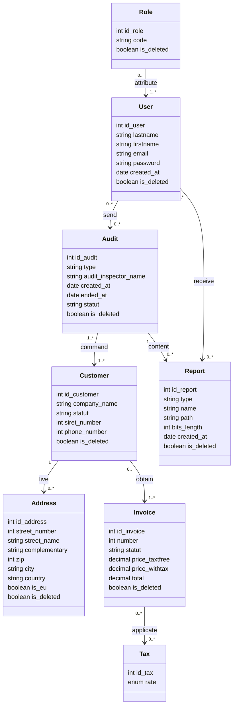

```mermaid
classDiagram

class Role {
  int id_role
  string code
  boolean is_deleted
}

class User {
  int id_user
  string lastname
  string firstname
  string email
  string password
  date created_at
  boolean is_deleted
}

class Address {
  int id_address
  int street_number
  string street_name
  string complementary
  int zip
  string city
  string country
  boolean is_eu
  boolean is_deleted
}

class Customer {
  int id_customer
  string company_name
  string statut
  int siret_number
  int phone_number
  boolean is_deleted
}

class Invoice {
  int id_invoice
  int number
  string statut
  decimal price_taxtfree
  decimal price_withtax
  decimal total
  boolean is_deleted
}

class Tax {
  int id_tax
  enum rate
}

class Audit {
  int id_audit
  string type
  string audit_inspector_name
  date created_at
  date ended_at
  string statut
  boolean is_deleted
}

class Report {
  int id_report
  string type
  string name
  string path
  int bits_length
  date created_at
  boolean is_deleted
}

%% Associations
Role "0.." --> "1..*" User : attribute
User "0..*" --> "0..*" Audit : send
User "0..*" --> "0..*" Report : receive
Audit "1" --> "0..*" Report : content
Audit "1..*" --> "1..*" Customer : command
Customer "1" --> "0..*" Address : live
Customer "0.." --> "1..*" Invoice : obtain
Invoice "0..*" --> "0..*" Tax : applicate

```
